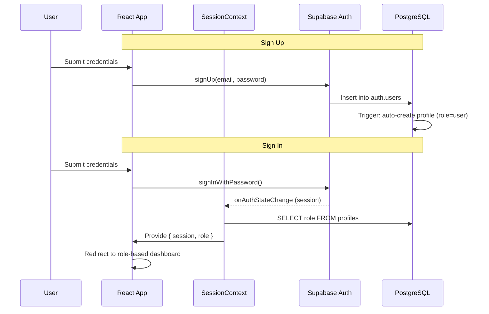
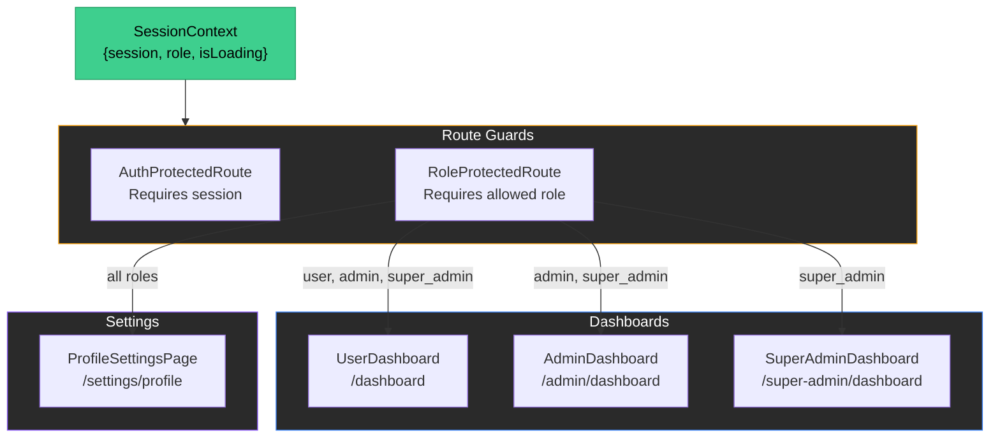

# PawConnect AI

A full-stack web application for dog owners, powered by AI. Built with React, Supabase, and Tailwind CSS.

**Course:** CAI3303C — Natural Language Processing (Spring 2026)

---

## Features

- **AI Chat** — Conversational AI assistant for dog-related questions
- **Role-Based Access Control (RBAC)** — Three user roles: `user`, `admin`, `super_admin`
- **Role-Based Dashboards** — Each role has its own dashboard with appropriate permissions
- **Profile Settings** — Users can manage their personal info and dog details
- **Row-Level Security (RLS)** — Database-level access control via Supabase policies
- **Landing Page** — Marketing page with hero, features, pricing, ROI calculator, social proof
- **Authentication** — Sign up, sign in, sign out with Supabase Auth
- **Protected Routes** — Auth guards and role-based route guards

---

## Tech Stack

| Layer | Technology |
|-------|------------|
| UI Framework | React 19 |
| Routing | React Router v7 |
| State Management | React Context API |
| Backend | Supabase (Auth, PostgreSQL, RLS) |
| Build Tool | Vite 6 |
| Language | TypeScript 5.7 |
| Styling | Tailwind CSS 3 + DaisyUI 5 |
| Animations | Framer Motion |
| Icons | Heroicons, Lucide React |

---

## User Roles

| Role | Dashboard | Capabilities |
|------|-----------|-------------|
| `user` | `/dashboard` | View own profile, AI Chat, profile settings |
| `admin` | `/admin/dashboard` | Everything above + view all users |
| `super_admin` | `/super-admin/dashboard` | Everything above + change roles, delete users |

After sign-in, users are automatically redirected to their role-appropriate dashboard.

---

## Database Schema

### `profiles` table

| Column | Type | Notes |
|--------|------|-------|
| `id` | UUID (PK) | References `auth.users.id` |
| `email` | TEXT | From auth signup |
| `role` | `user_role` enum | `user`, `admin`, `super_admin` |
| `display_name` | TEXT | |
| `bio` | TEXT | |
| `avatar_url` | TEXT | |
| `phone_number` | TEXT (NOT NULL) | Required field |
| `location` | TEXT | City / region |
| `dog_name` | TEXT | |
| `dog_breed` | TEXT | |
| `years_as_owner` | INTEGER | |
| `created_at` | TIMESTAMPTZ | Auto-set |
| `updated_at` | TIMESTAMPTZ | Auto-updated via trigger |

A profile is **automatically created** when a new user signs up (via a database trigger on `auth.users`).

### RLS Policies

- **Users** can read and update their own profile (cannot change their role)
- **Admins** can read all profiles
- **Super Admins** have full CRUD access on all profiles
- A `SECURITY DEFINER` function (`get_user_role`) is used to avoid infinite recursion in policies

---

## Project Structure

```
src/
├── components/
│   ├── backgrounds/        # Aurora background effect
│   ├── common/             # Button, Container, SectionWrapper
│   ├── landing/            # Hero, Features, Pricing, Footer, Navbar, etc.
│   ├── ui/                 # Dock, Magnet, ShinyText
│   ├── FloatingChatWidget.tsx
│   └── GlowingAIChat.tsx
├── context/
│   ├── SessionContext.tsx   # Auth session + role provider
│   └── ThemeContext.tsx     # Theme provider
├── hooks/
│   └── useReducedMotion.ts
├── lib/
│   └── utils.ts            # cn() utility (clsx + tailwind-merge)
├── pages/
│   ├── auth/
│   │   ├── SignInPage.tsx   # Role-based redirect after login
│   │   └── SignUpPage.tsx
│   ├── dashboard/
│   │   ├── UserDashboard.tsx
│   │   ├── AdminDashboard.tsx
│   │   └── SuperAdminDashboard.tsx
│   ├── settings/
│   │   └── ProfileSettingsPage.tsx
│   ├── 404Page.tsx
│   ├── AIChatPage.tsx
│   ├── HomePage.tsx
│   ├── LandingPage.tsx
│   ├── LoadingPage.tsx
│   └── ProtectedPage.tsx
├── router/
│   ├── index.tsx            # All routes
│   ├── AuthProtectedRoute.tsx
│   └── RoleProtectedRoute.tsx
├── supabase/
│   └── index.ts             # Supabase client
├── types/
│   └── landing.ts
├── utils/
│   └── roiCalculator.ts
├── config.ts
├── main.tsx
├── Providers.tsx
└── index.css
```

---

## Routes

| Path | Access | Page |
|------|--------|------|
| `/` | Public | Landing Page |
| `/auth/sign-in` | Public | Sign In |
| `/auth/sign-up` | Public | Sign Up |
| `/ai-chat` | Public | AI Chat |
| `/dashboard` | `user`, `admin`, `super_admin` | User Dashboard |
| `/admin/dashboard` | `admin`, `super_admin` | Admin Dashboard |
| `/super-admin/dashboard` | `super_admin` | Super Admin Dashboard |
| `/settings/profile` | `user`, `admin`, `super_admin` | Profile Settings |
| `/protected` | Authenticated | Protected Page |

---

## Architecture

### Authentication & Role Flow



### RBAC Data Flow



---

## Getting Started

1. **Clone** the repository
2. **Install** dependencies:
   ```bash
   npm install
   ```
3. **Configure** environment variables — create `.env.local`:
   ```
   VITE_SUPABASE_URL=your_supabase_url
   VITE_SUPABASE_ANON_KEY=your_supabase_anon_key
   ```
4. **Run** the development server:
   ```bash
   npm run dev
   ```
5. Open **http://localhost:5173**

---

## Key Files

| File | Purpose |
|------|---------|
| `src/context/SessionContext.tsx` | Provides `useSession()` hook with `{ session, role, isLoading }` |
| `src/router/index.tsx` | All route definitions |
| `src/router/RoleProtectedRoute.tsx` | Role-based route guard component |
| `src/Providers.tsx` | Wraps app with SessionProvider and ThemeProvider |
| `src/supabase/index.ts` | Supabase client instance |

---

## License

MIT
