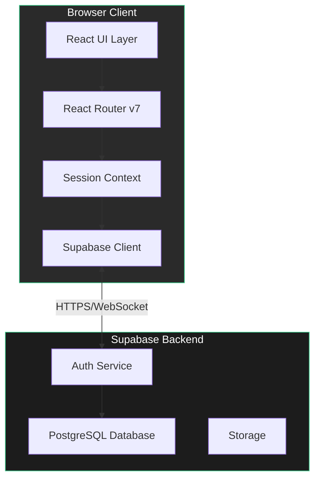
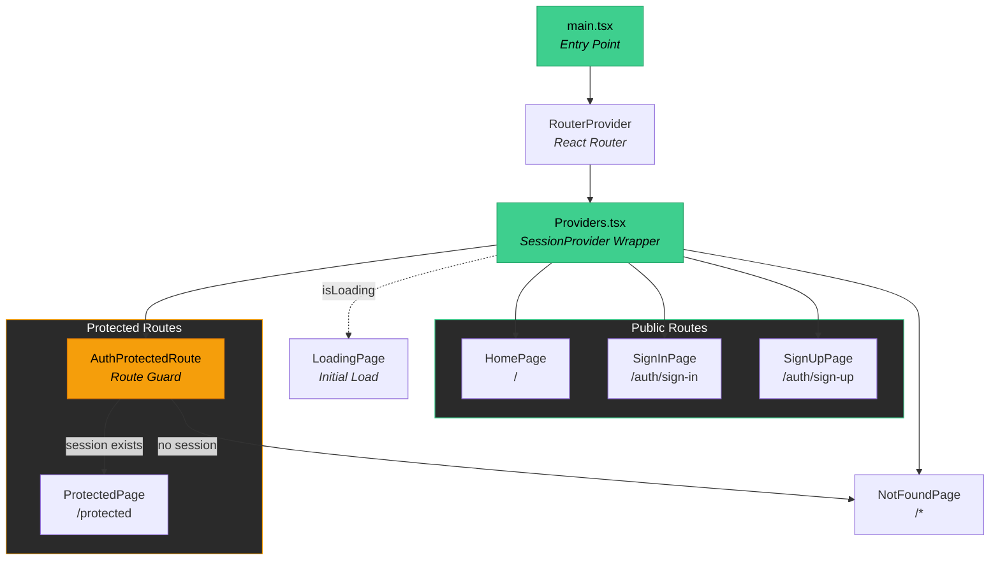
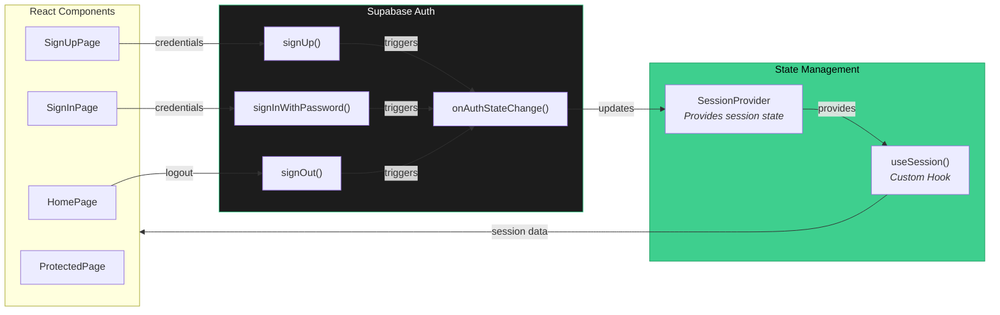
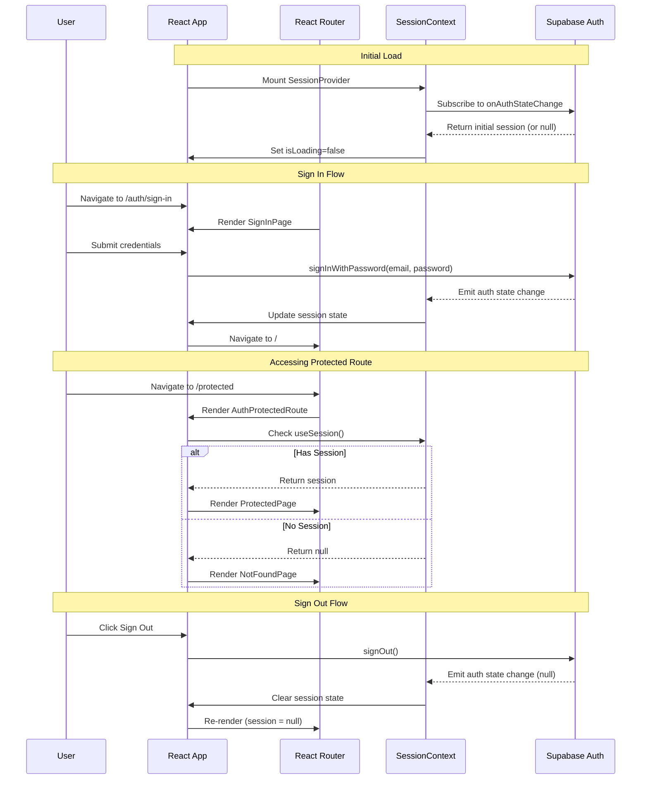
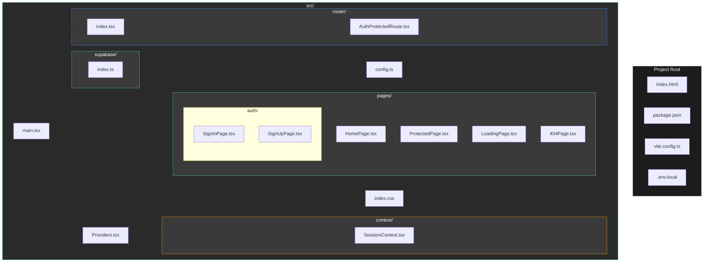

<p align="center">
<h1 align="center">React Supabase Auth with Protected Routes</h1>
</p>

<p align="center">

</p>

[**`App Demo`**](https://react-supabase-auth-template.vercel.app/)

## Features

- Protected Routes
- Supabase Session Object in Global Context via `useSession`
- User Authentication
- Routing and Route Guards

It's also blazingly fast. [Try it out for yourself.](https://react-supabase-auth-template.vercel.app/)

[We also have a similar template for FIREBASE](https://github.com/mmvergara/react-firebase-auth-template)

---

## Architecture Overview

### High-Level Architecture



### Component Hierarchy



### Data Flow



### Authentication & Routing Integration



### Project Structure



### Tech Stack

| Layer | Technology |
|-------|------------|
| UI Framework | React 19 |
| Routing | React Router v7.6 |
| State Management | React Context API |
| Backend | Supabase (Auth, PostgreSQL) |
| Build Tool | Vite 6 |
| Language | TypeScript 5.7 |
| Styling | CSS |

---

## Getting Started

1. Clone the repository
2. Install dependencies: `npm install`
3. Create `.env` using the `.env.example` as a template
```
VITE_SUPABASE_URL=
VITE_SUPABASE_ANON_KEY=
```
4. Run the app: `npm run dev`

## What you need to know

- `/router/index.tsx` is where you declare your routes
- `/context/SessionContext.tsx` is where you can find the `useSession` hook
  - This hook gives you access to the `session` object from Supabase globally
- `/Providers.tsx` is where you can add more `providers` or `wrappers`

## Other Supabase Templates

- [React ShadCN Supabase Auth Template](https://github.com/mmvergara/react-supabase-shadcn-auth-template)
- [NextJs ShadCN Supabase Auth Template](https://github.com/mmvergara/nextjs-shadcn-supabase-auth-starter)

## More Starter Templates

- [NextJs MongoDB Prisma Auth Template](https://github.com/mmvergara/nextjs-mongodb-prisma-auth-template)
- [NextJs Discord Bot Template](https://github.com/mmvergara/nextjs-discord-bot-boilerplate)
- [React Firebase Auth Template](https://github.com/mmvergara/react-firebase-auth-template)
- [Golang Postgres Auth Template](https://github.com/mmvergara/golang-postgresql-auth-template)
- [Vue Golang PostgresSql Auth Template](https://github.com/mmvergara/vue-golang-postgresql-auth-starter-template)
- [Vue Supabase Auth Template](https://github.com/mmvergara/vue-supabase-auth-starter-template)
- [Remix Drizzle Auth Template](https://github.com/mmvergara/remix-drizzle-auth-template)
