# PawConnect AI

A full-stack web application for dog owners, powered by AI. Built with React, Supabase, and Tailwind CSS. Features a RAG chatbot with pgvector, role-based access control, editable user profiles, and advanced animated UI components.

**Course:** CAI3303C — Natural Language Processing (Spring 2026)

---

## Table of Contents

1. [Features](#features)
2. [Tech Stack](#tech-stack)
3. [UI Component Libraries](#ui-component-libraries)
4. [User Roles](#user-roles)
5. [Routes](#routes)
6. [Database Schema](#database-schema)
7. [Supabase Edge Functions](#supabase-edge-functions)
8. [MCP Server Integration](#mcp-server-integration)
9. [Architecture Diagrams](#architecture-diagrams)
10. [Project Structure](#project-structure)
11. [Getting Started](#getting-started)
12. [Category Mapping](#category-mapping)
13. [License](#license)

---

## Features

- **RAG Chatbot with pgvector** — Conversational AI assistant using Retrieval-Augmented Generation with Gemini 2.5 Flash and pgvector semantic search
- **PDF & DOCX Upload** — Client-side text extraction via `pdfjs-dist` and `mammoth`, with server-side chunking and embedding
- **Public Landing Page Chatbot** — Floating chat widget that answers visitor questions without login
- **Role-Based Access Control (RBAC)** — Three user roles: `user`, `admin`, `super_admin`
- **Role-Based Dashboards** — Each role has its own dashboard with appropriate permissions
- **Editable User Profile** — Users can manage display name, bio, avatar, phone, location
- **Multi-Dog Support** — Add, edit, delete dogs with photo uploads and breed selection
- **Row-Level Security (RLS)** — Database-level access control via Supabase policies
- **Landing Page** — Marketing page with hero, features, pricing, ROI calculator, social proof
- **Authentication** — Sign up, sign in, sign out with Supabase Auth
- **Protected Routes** — Auth guards and role-based route guards
- **Advanced Animations** — Aurora WebGL background, ChromaGrid, animated data tables, Framer Motion transitions

---

## Tech Stack

| Layer | Technology |
|-------|------------|
| UI Framework | React 19 |
| Routing | React Router v7 |
| State Management | React Context API |
| Backend | Supabase (Auth, PostgreSQL, RLS, Edge Functions, Storage) |
| AI / LLM | Google Gemini 2.5 Flash + Gemini Embedding 001 |
| Vector Search | pgvector 0.8.0 |
| Build Tool | Vite 6 |
| Language | TypeScript 5.7 |
| Styling | Tailwind CSS 3 + DaisyUI 5 |
| Animations | Framer Motion 12, GSAP 3, OGL (WebGL) |
| PDF Parsing | pdfjs-dist (Mozilla) |
| DOCX Parsing | mammoth |
| Icons | Heroicons, Lucide React |

---

## UI Component Libraries

### ReactBits

| Component | File | Used On |
|-----------|------|---------|
| **Aurora** | `src/components/backgrounds/Aurora.jsx` | Landing Page (HeroSection) — WebGL aurora borealis background |
| **ShinyText** | `src/components/ui/ShinyText.tsx` | Landing Page (Navbar) — Animated gradient shine on "PawConnect AI" logo |
| **ChromaGrid** | `src/components/ui/ChromaGrid.tsx` | User Dashboard — GSAP-powered interactive card grid with mouse-tracking |
| **Dock** | `src/components/ui/Dock.tsx` | Available (not yet integrated) — macOS-style dock with magnetic hover |
| **Magnet** | `src/components/ui/Magnet.tsx` | Available (not yet integrated) — Mouse-following magnetic element |

### 21st.dev

| Component | Source | Used On |
|-----------|--------|---------|
| **Popover** | [efferd/popover](https://21st.dev/efferd/popover/default) | Admin Dashboard — Column visibility toggle dropdown in data table |
| **Project Data Table** | [ravikatiyar/project-data-table](https://21st.dev/ravikatiyar/project-data-table/default) | Admin Dashboard — Animated user data table with search, role filter, column toggle |

Both 21st.dev components are combined in `src/components/ui/UserDataTable.tsx`.

---

## User Roles

| Role | Dashboard | Capabilities |
|------|-----------|-------------|
| `user` | `/dashboard` | View own profile, AI Chat, profile settings, manage dogs |
| `admin` | `/admin/dashboard` | Everything above + view all users in data table |
| `super_admin` | `/super-admin/dashboard` | Everything above + change roles, delete users |

After sign-in, users are automatically redirected to their role-appropriate dashboard.

---

## Routes

| Path | Access | Page |
|------|--------|------|
| `/` | Public | Landing Page (with floating AI chat widget) |
| `/auth/sign-in` | Public | Sign In |
| `/auth/sign-up` | Public | Sign Up |
| `/ai-chat` | Authenticated | AI Chat (RAG chatbot with knowledge base) |
| `/dashboard` | `user`, `admin`, `super_admin` | User Dashboard |
| `/admin/dashboard` | `admin`, `super_admin` | Admin Dashboard |
| `/super-admin/dashboard` | `super_admin` | Super Admin Dashboard |
| `/settings/profile` | Authenticated | Profile Settings |
| `/settings/my-dogs` | Authenticated | My Dogs (CRUD) |

---

## Database Schema

### Tables

#### `profiles`

| Column | Type | Nullable | Default | Notes |
|--------|------|----------|---------|-------|
| `id` | UUID (PK) | NO | — | References `auth.users.id` |
| `email` | TEXT | YES | — | From auth signup |
| `role` | `user_role` enum | NO | `'user'` | `user`, `admin`, `super_admin` |
| `display_name` | TEXT | YES | `''` | |
| `bio` | TEXT | YES | `''` | |
| `avatar_url` | TEXT | YES | `''` | |
| `phone_number` | TEXT | NO | `''` | Required field |
| `location` | TEXT | YES | `''` | City / region |
| `created_at` | TIMESTAMPTZ | NO | `now()` | Auto-set |
| `updated_at` | TIMESTAMPTZ | NO | `now()` | Auto-updated via trigger |

A profile is **automatically created** when a new user signs up (via the `handle_new_user` trigger on `auth.users`).

#### `dogs`

| Column | Type | Nullable | Default |
|--------|------|----------|---------|
| `id` | UUID (PK) | NO | `gen_random_uuid()` |
| `owner_id` | UUID (FK → profiles.id) | NO | — |
| `name` | TEXT | NO | `''` |
| `breed` | TEXT | YES | `''` |
| `age` | INTEGER | YES | `0` |
| `notes` | TEXT | YES | `''` |
| `photo_url` | TEXT | YES | `''` |
| `created_at` | TIMESTAMPTZ | YES | `now()` |
| `updated_at` | TIMESTAMPTZ | YES | `now()` |

#### `dog_breeds`

| Column | Type | Nullable | Default |
|--------|------|----------|---------|
| `id` | INTEGER (PK) | NO | Auto-increment |
| `name` | TEXT | NO | — |
| `group_name` | TEXT | YES | `''` |

Reference table with 200+ breeds for the breed dropdown.

#### `conversations`

| Column | Type | Nullable | Default |
|--------|------|----------|---------|
| `id` | UUID (PK) | NO | `gen_random_uuid()` |
| `user_id` | UUID (FK) | NO | — |
| `title` | TEXT | NO | `'New conversation'` |
| `created_at` | TIMESTAMPTZ | NO | `now()` |
| `updated_at` | TIMESTAMPTZ | NO | `now()` |

#### `chat_history`

| Column | Type | Nullable | Default |
|--------|------|----------|---------|
| `id` | UUID (PK) | NO | `gen_random_uuid()` |
| `conversation_id` | UUID (FK) | NO | — |
| `user_id` | UUID (FK) | NO | — |
| `role` | TEXT | NO | — | `'user'` or `'assistant'` |
| `content` | TEXT | NO | — |
| `created_at` | TIMESTAMPTZ | NO | `now()` |

#### `documents`

| Column | Type | Nullable | Default |
|--------|------|----------|---------|
| `id` | UUID (PK) | NO | `gen_random_uuid()` |
| `title` | TEXT | NO | — |
| `content` | TEXT | NO | — |
| `embedding` | vector(768) | YES | — | pgvector column for semantic search |
| `uploaded_by` | UUID (FK) | YES | — |
| `created_at` | TIMESTAMPTZ | NO | `now()` |

### Database Functions

| Function | Purpose |
|----------|---------|
| `handle_new_user()` | Trigger: auto-creates a `profiles` row when a new user signs up |
| `handle_updated_at()` | Trigger: auto-updates `updated_at` on row changes |
| `get_user_role(user_id)` | `SECURITY DEFINER` function for RLS policies (avoids infinite recursion) |
| `match_documents(query_embedding, match_count)` | Cosine similarity search against document embeddings via pgvector |
| `vault_read_secret(secret_name)` | Reads secrets from Supabase Vault (used for `GOOGLE_API_KEY`) |

### Extensions

| Extension | Version | Purpose |
|-----------|---------|---------|
| `pgvector` | 0.8.0 | Vector similarity search for RAG chatbot |
| `pg_vault` | — | Secure secret storage (Google API key) |

### Storage Buckets

| Bucket | Public | Purpose |
|--------|--------|---------|
| `avatars` | Yes | User profile photos |
| `dog-photos` | Yes | Dog photos |

### RLS Policies

- **Users** can read and update their own profile (cannot change their role)
- **Admins** can read all profiles
- **Super Admins** have full CRUD access on all profiles
- The `get_user_role()` `SECURITY DEFINER` function is used to avoid infinite recursion in policies

---

## Supabase Edge Functions

| Function | Endpoint | Auth | Description |
|----------|----------|------|-------------|
| **chat-response** (v6) | `POST /functions/v1/chat-response` | Required | Authenticated RAG chatbot. Generates query embedding, performs similarity search via `match_documents`, builds prompt with retrieved context, calls Gemini 2.5 Flash, saves exchange to `chat_history`. |
| **chat-public** (v1) | `POST /functions/v1/chat-public` | None | Public landing page assistant. Uses hardcoded landing page context (features, pricing, stats). Answers visitor questions, nudges sign-up for personalized help. No data saved. |
| **generate-embeddings** (v7) | `POST /functions/v1/generate-embeddings` | None | Document upload with chunking. Splits content into ~4000-char chunks, generates Gemini embedding per chunk (1.5s delay + retry on 429), inserts all chunks into `documents` table. |
| **seed-knowledge-base** (v2) | `GET /functions/v1/seed-knowledge-base` | None | Initializes knowledge base with starter canine behavior documents. |

### Edge Function Input/Output

```
chat-response
  Input:  { question, user_id, conversation_id }
  Output: { answer, sources: [{ title, similarity }] }

chat-public
  Input:  { question }
  Output: { answer }

generate-embeddings
  Input:  { title, content, uploaded_by }
  Output: { success, documents, chunks }
```

---

## MCP Server Integration

Three MCP servers are configured in `.mcp.json`:

| MCP Server | Type | Purpose |
|------------|------|---------|
| **Supabase** | HTTP (`mcp.supabase.com`) | Database schema inspection, migrations, edge function management, SQL execution |
| **shadcn** | Command (`npx shadcn@latest mcp`) | UI component registry access |
| **Netlify** | Command (`npx @netlify/mcp`) | Deployment and environment management |

---

## UML Diagrams

### 1. Use Case Diagram

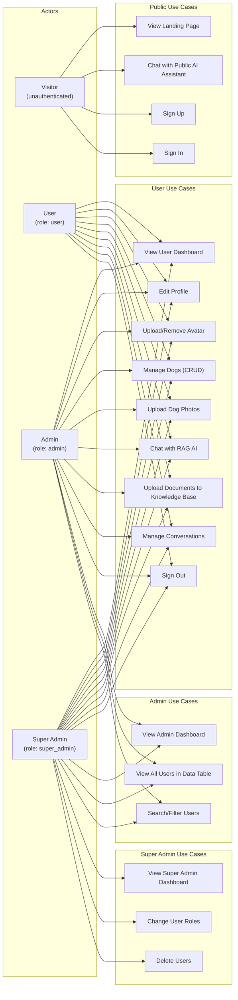
```mermaid
flowchart LR
    subgraph Actors
        V["Visitor\n(unauthenticated)"]
        U["User\n(role: user)"]
        A["Admin\n(role: admin)"]
        SA["Super Admin\n(role: super_admin)"]
    end

    subgraph UC_Public["Public Use Cases"]
        UC1["View Landing Page"]
        UC2["Chat with Public AI Assistant"]
        UC3["Sign Up"]
        UC4["Sign In"]
    end

    subgraph UC_User["User Use Cases"]
        UC5["View User Dashboard"]
        UC6["Edit Profile"]
        UC7["Upload/Remove Avatar"]
        UC8["Manage Dogs (CRUD)"]
        UC9["Upload Dog Photos"]
        UC10["Chat with RAG AI"]
        UC11["Upload Documents to Knowledge Base"]
        UC12["Manage Conversations"]
        UC13["Sign Out"]
    end

    subgraph UC_Admin["Admin Use Cases"]
        UC14["View Admin Dashboard"]
        UC15["View All Users in Data Table"]
        UC16["Search/Filter Users"]
    end

    subgraph UC_SuperAdmin["Super Admin Use Cases"]
        UC17["View Super Admin Dashboard"]
        UC18["Change User Roles"]
        UC19["Delete Users"]
    end

    V --> UC1
    V --> UC2
    V --> UC3
    V --> UC4

    U --> UC5
    U --> UC6
    U --> UC7
    U --> UC8
    U --> UC9
    U --> UC10
    U --> UC11
    U --> UC12
    U --> UC13

    A --> UC5
    A --> UC6
    A --> UC7
    A --> UC8
    A --> UC9
    A --> UC10
    A --> UC11
    A --> UC12
    A --> UC13
    A --> UC14
    A --> UC15
    A --> UC16

    SA --> UC5
    SA --> UC6
    SA --> UC7
    SA --> UC8
    SA --> UC9
    SA --> UC10
    SA --> UC11
    SA --> UC12
    SA --> UC13
    SA --> UC14
    SA --> UC15
    SA --> UC16
    SA --> UC17
    SA --> UC18
    SA --> UC19
```

### 2. Class Diagram (TypeScript Interfaces & Data Models)

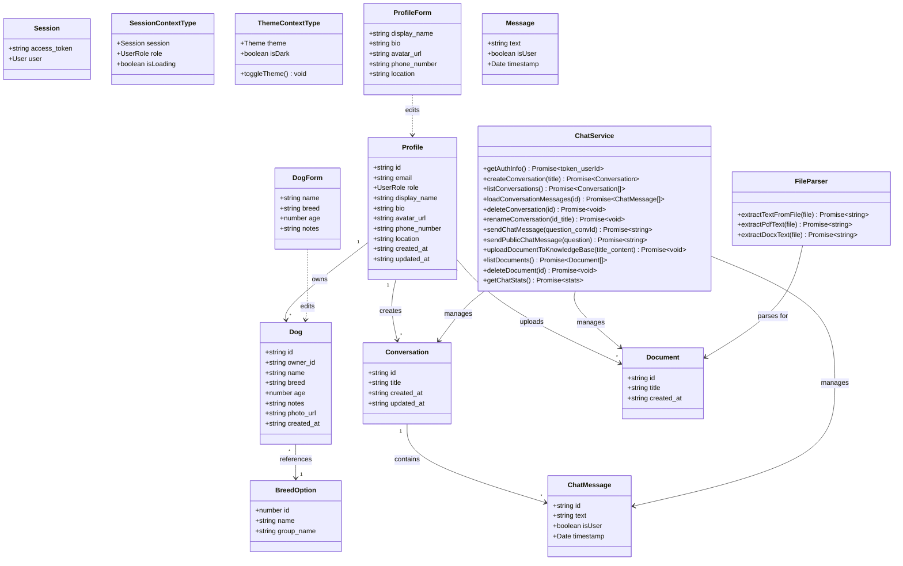
```mermaid
classDiagram
    class Session {
        +string access_token
        +User user
    }

    class SessionContextType {
        +Session session
        +UserRole role
        +boolean isLoading
    }

    class ThemeContextType {
        +Theme theme
        +boolean isDark
        +toggleTheme() void
    }

    class ProfileForm {
        +string display_name
        +string bio
        +string avatar_url
        +string phone_number
        +string location
    }

    class Profile {
        +string id
        +string email
        +UserRole role
        +string display_name
        +string bio
        +string avatar_url
        +string phone_number
        +string location
        +string created_at
        +string updated_at
    }

    class Dog {
        +string id
        +string owner_id
        +string name
        +string breed
        +number age
        +string notes
        +string photo_url
        +string created_at
    }

    class DogForm {
        +string name
        +string breed
        +number age
        +string notes
    }

    class BreedOption {
        +number id
        +string name
        +string group_name
    }

    class Conversation {
        +string id
        +string title
        +string created_at
        +string updated_at
    }

    class ChatMessage {
        +string id
        +string text
        +boolean isUser
        +Date timestamp
    }

    class Document {
        +string id
        +string title
        +string created_at
    }

    class Message {
        +string text
        +boolean isUser
        +Date timestamp
    }

    class ChatService {
        +getAuthInfo() Promise~token_userId~
        +createConversation(title) Promise~Conversation~
        +listConversations() Promise~Conversation[]~
        +loadConversationMessages(id) Promise~ChatMessage[]~
        +deleteConversation(id) Promise~void~
        +renameConversation(id_title) Promise~void~
        +sendChatMessage(question_convId) Promise~string~
        +sendPublicChatMessage(question) Promise~string~
        +uploadDocumentToKnowledgeBase(title_content) Promise~void~
        +listDocuments() Promise~Document[]~
        +deleteDocument(id) Promise~void~
        +getChatStats() Promise~stats~
    }

    class FileParser {
        +extractTextFromFile(file) Promise~string~
        +extractPdfText(file) Promise~string~
        +extractDocxText(file) Promise~string~
    }

    Profile "1" --> "*" Dog : owns
    Profile "1" --> "*" Conversation : creates
    Profile "1" --> "*" Document : uploads
    Conversation "1" --> "*" ChatMessage : contains
    Dog "*" --> "1" BreedOption : references
    ProfileForm ..> Profile : edits
    DogForm ..> Dog : edits
    ChatService --> Conversation : manages
    ChatService --> ChatMessage : manages
    ChatService --> Document : manages
    FileParser --> Document : parses for
```

### 3. Sequence Diagram — Authentication & Role Flow

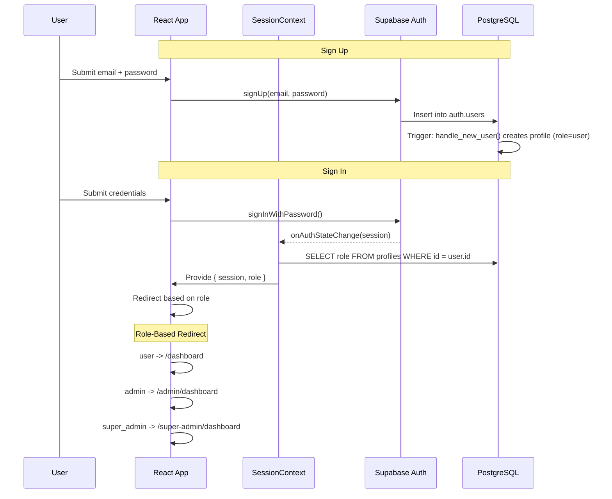
```mermaid
sequenceDiagram
    participant User
    participant App as React App
    participant Context as SessionContext
    participant Supabase as Supabase Auth
    participant DB as PostgreSQL

    Note over App,DB: Sign Up
    User->>App: Submit email + password
    App->>Supabase: signUp(email, password)
    Supabase->>DB: Insert into auth.users
    DB->>DB: Trigger: handle_new_user() creates profile (role=user)

    Note over App,DB: Sign In
    User->>App: Submit credentials
    App->>Supabase: signInWithPassword()
    Supabase-->>Context: onAuthStateChange(session)
    Context->>DB: SELECT role FROM profiles WHERE id = user.id
    Context->>App: Provide { session, role }
    App->>App: Redirect based on role

    Note over App: Role-Based Redirect
    App->>App: user -> /dashboard
    App->>App: admin -> /admin/dashboard
    App->>App: super_admin -> /super-admin/dashboard
```

### 4. Sequence Diagram — Profile Management

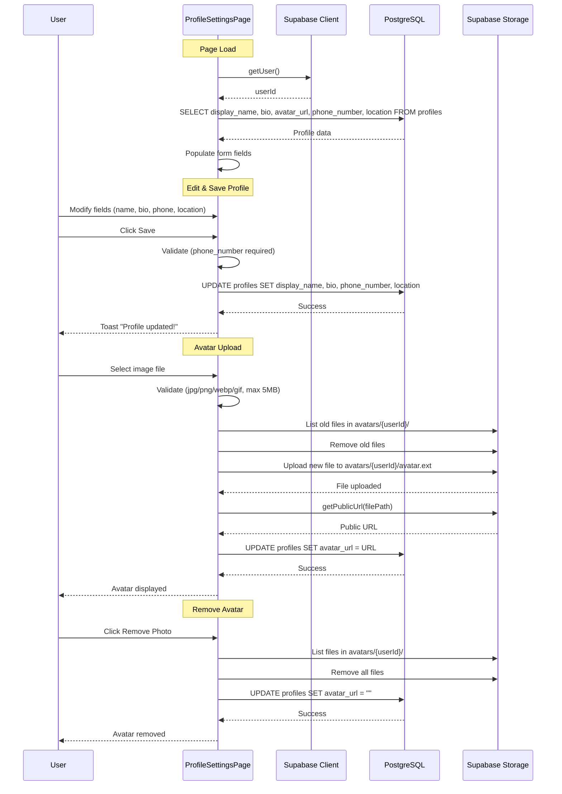
```mermaid
sequenceDiagram
    participant User
    participant Page as ProfileSettingsPage
    participant SB as Supabase Client
    participant DB as PostgreSQL
    participant Storage as Supabase Storage

    Note over Page: Page Load
    Page->>SB: getUser()
    SB-->>Page: userId
    Page->>DB: SELECT display_name, bio, avatar_url, phone_number, location FROM profiles
    DB-->>Page: Profile data
    Page->>Page: Populate form fields

    Note over Page: Edit & Save Profile
    User->>Page: Modify fields (name, bio, phone, location)
    User->>Page: Click Save
    Page->>Page: Validate (phone_number required)
    Page->>DB: UPDATE profiles SET display_name, bio, phone_number, location
    DB-->>Page: Success
    Page-->>User: Toast "Profile updated!"

    Note over Page: Avatar Upload
    User->>Page: Select image file
    Page->>Page: Validate (jpg/png/webp/gif, max 5MB)
    Page->>Storage: List old files in avatars/{userId}/
    Page->>Storage: Remove old files
    Page->>Storage: Upload new file to avatars/{userId}/avatar.ext
    Storage-->>Page: File uploaded
    Page->>Storage: getPublicUrl(filePath)
    Storage-->>Page: Public URL
    Page->>DB: UPDATE profiles SET avatar_url = URL
    DB-->>Page: Success
    Page-->>User: Avatar displayed

    Note over Page: Remove Avatar
    User->>Page: Click Remove Photo
    Page->>Storage: List files in avatars/{userId}/
    Page->>Storage: Remove all files
    Page->>DB: UPDATE profiles SET avatar_url = ""
    DB-->>Page: Success
    Page-->>User: Avatar removed
```

### 5. Sequence Diagram — Dog CRUD

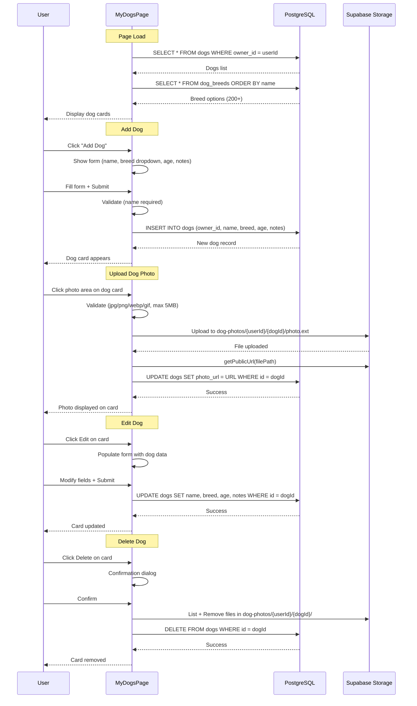
```mermaid
sequenceDiagram
    participant User
    participant Page as MyDogsPage
    participant DB as PostgreSQL
    participant Storage as Supabase Storage

    Note over Page: Page Load
    Page->>DB: SELECT * FROM dogs WHERE owner_id = userId
    DB-->>Page: Dogs list
    Page->>DB: SELECT * FROM dog_breeds ORDER BY name
    DB-->>Page: Breed options (200+)
    Page-->>User: Display dog cards

    Note over Page: Add Dog
    User->>Page: Click "Add Dog"
    Page->>Page: Show form (name, breed dropdown, age, notes)
    User->>Page: Fill form + Submit
    Page->>Page: Validate (name required)
    Page->>DB: INSERT INTO dogs (owner_id, name, breed, age, notes)
    DB-->>Page: New dog record
    Page-->>User: Dog card appears

    Note over Page: Upload Dog Photo
    User->>Page: Click photo area on dog card
    Page->>Page: Validate (jpg/png/webp/gif, max 5MB)
    Page->>Storage: Upload to dog-photos/{userId}/{dogId}/photo.ext
    Storage-->>Page: File uploaded
    Page->>Storage: getPublicUrl(filePath)
    Page->>DB: UPDATE dogs SET photo_url = URL WHERE id = dogId
    DB-->>Page: Success
    Page-->>User: Photo displayed on card

    Note over Page: Edit Dog
    User->>Page: Click Edit on card
    Page->>Page: Populate form with dog data
    User->>Page: Modify fields + Submit
    Page->>DB: UPDATE dogs SET name, breed, age, notes WHERE id = dogId
    DB-->>Page: Success
    Page-->>User: Card updated

    Note over Page: Delete Dog
    User->>Page: Click Delete on card
    Page->>Page: Confirmation dialog
    User->>Page: Confirm
    Page->>Storage: List + Remove files in dog-photos/{userId}/{dogId}/
    Page->>DB: DELETE FROM dogs WHERE id = dogId
    DB-->>Page: Success
    Page-->>User: Card removed
```

### 6. Sequence Diagram — Super Admin User Management

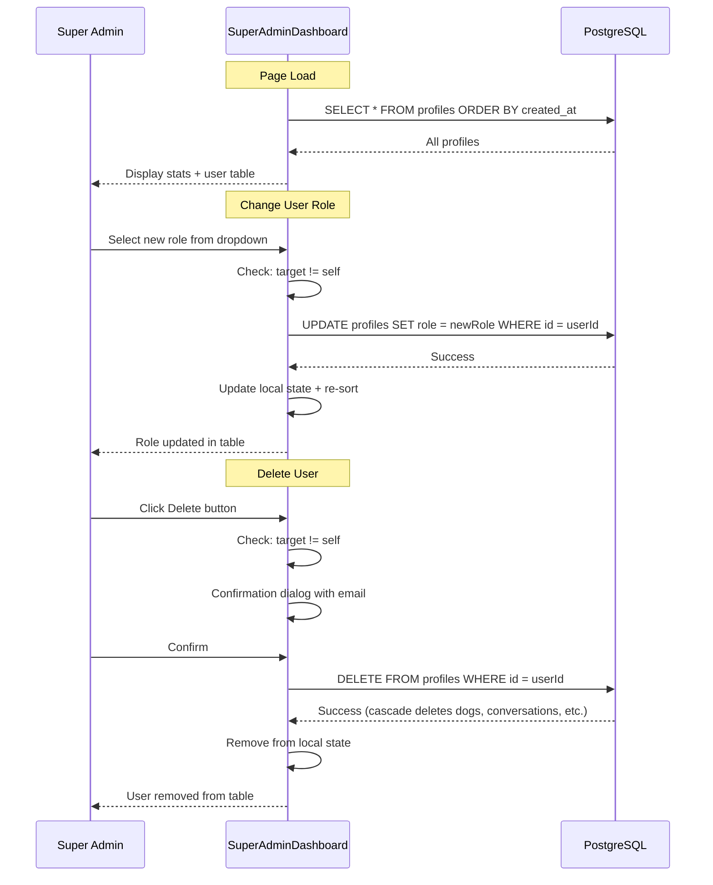
```mermaid
sequenceDiagram
    participant SA as Super Admin
    participant Page as SuperAdminDashboard
    participant DB as PostgreSQL

    Note over Page: Page Load
    Page->>DB: SELECT * FROM profiles ORDER BY created_at
    DB-->>Page: All profiles
    Page-->>SA: Display stats + user table

    Note over Page: Change User Role
    SA->>Page: Select new role from dropdown
    Page->>Page: Check: target != self
    Page->>DB: UPDATE profiles SET role = newRole WHERE id = userId
    DB-->>Page: Success
    Page->>Page: Update local state + re-sort
    Page-->>SA: Role updated in table

    Note over Page: Delete User
    SA->>Page: Click Delete button
    Page->>Page: Check: target != self
    Page->>Page: Confirmation dialog with email
    SA->>Page: Confirm
    Page->>DB: DELETE FROM profiles WHERE id = userId
    DB-->>Page: Success (cascade deletes dogs, conversations, etc.)
    Page->>Page: Remove from local state
    Page-->>SA: User removed from table
```

### 7. Sequence Diagram — RAG Chatbot Pipeline

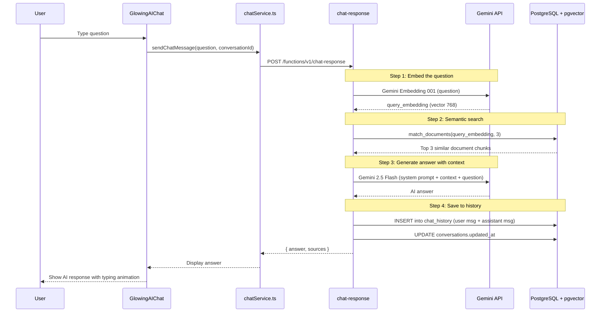
```mermaid
sequenceDiagram
    participant User
    participant Chat as GlowingAIChat
    participant Service as chatService.ts
    participant Edge as chat-response
    participant Gemini as Gemini API
    participant DB as PostgreSQL + pgvector

    User->>Chat: Type question
    Chat->>Service: sendChatMessage(question, conversationId)
    Service->>Edge: POST /functions/v1/chat-response

    Note over Edge,Gemini: Step 1: Embed the question
    Edge->>Gemini: Gemini Embedding 001 (question)
    Gemini-->>Edge: query_embedding (vector 768)

    Note over Edge,DB: Step 2: Semantic search
    Edge->>DB: match_documents(query_embedding, 3)
    DB-->>Edge: Top 3 similar document chunks

    Note over Edge,Gemini: Step 3: Generate answer with context
    Edge->>Gemini: Gemini 2.5 Flash (system prompt + context + question)
    Gemini-->>Edge: AI answer

    Note over Edge,DB: Step 4: Save to history
    Edge->>DB: INSERT into chat_history (user msg + assistant msg)
    Edge->>DB: UPDATE conversations.updated_at

    Edge-->>Service: { answer, sources }
    Service-->>Chat: Display answer
    Chat-->>User: Show AI response with typing animation
```

### 8. Sequence Diagram — Document Upload & Embedding

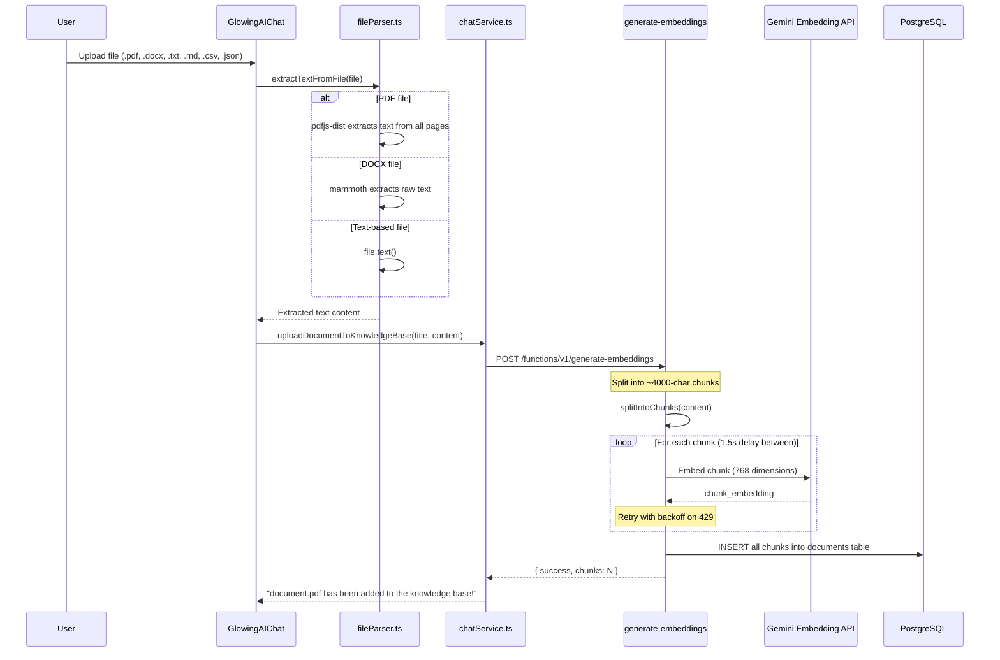
```mermaid
sequenceDiagram
    participant User
    participant Chat as GlowingAIChat
    participant Parser as fileParser.ts
    participant Service as chatService.ts
    participant Edge as generate-embeddings
    participant Gemini as Gemini Embedding API
    participant DB as PostgreSQL

    User->>Chat: Upload file (.pdf, .docx, .txt, .md, .csv, .json)
    Chat->>Parser: extractTextFromFile(file)

    alt PDF file
        Parser->>Parser: pdfjs-dist extracts text from all pages
    else DOCX file
        Parser->>Parser: mammoth extracts raw text
    else Text-based file
        Parser->>Parser: file.text()
    end

    Parser-->>Chat: Extracted text content
    Chat->>Service: uploadDocumentToKnowledgeBase(title, content)
    Service->>Edge: POST /functions/v1/generate-embeddings

    Note over Edge: Split into ~4000-char chunks
    Edge->>Edge: splitIntoChunks(content)

    loop For each chunk (1.5s delay between)
        Edge->>Gemini: Embed chunk (768 dimensions)
        Gemini-->>Edge: chunk_embedding
        Note over Edge: Retry with backoff on 429
    end

    Edge->>DB: INSERT all chunks into documents table
    Edge-->>Service: { success, chunks: N }
    Service-->>Chat: "document.pdf has been added to the knowledge base!"
```

### 9. Sequence Diagram — Public Landing Page Chat

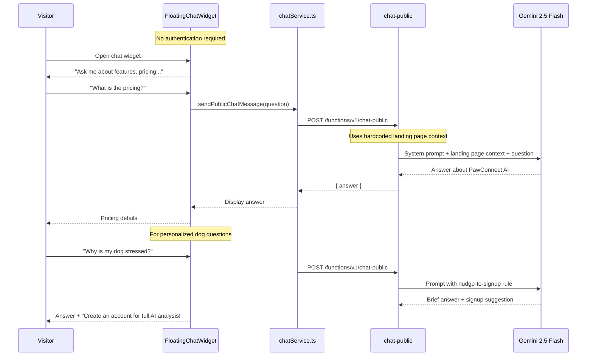
```mermaid
sequenceDiagram
    participant Visitor
    participant Widget as FloatingChatWidget
    participant Service as chatService.ts
    participant Edge as chat-public
    participant Gemini as Gemini 2.5 Flash

    Note over Widget: No authentication required
    Visitor->>Widget: Open chat widget
    Widget-->>Visitor: "Ask me about features, pricing..."

    Visitor->>Widget: "What is the pricing?"
    Widget->>Service: sendPublicChatMessage(question)
    Service->>Edge: POST /functions/v1/chat-public

    Note over Edge: Uses hardcoded landing page context
    Edge->>Gemini: System prompt + landing page context + question
    Gemini-->>Edge: Answer about PawConnect AI

    Edge-->>Service: { answer }
    Service-->>Widget: Display answer
    Widget-->>Visitor: Pricing details

    Note over Widget: For personalized dog questions
    Visitor->>Widget: "Why is my dog stressed?"
    Service->>Edge: POST /functions/v1/chat-public
    Edge->>Gemini: Prompt with nudge-to-signup rule
    Gemini-->>Edge: Brief answer + signup suggestion
    Widget-->>Visitor: Answer + "Create an account for full AI analysis!"
```

### 10. Activity Diagram — Route Guard Decision

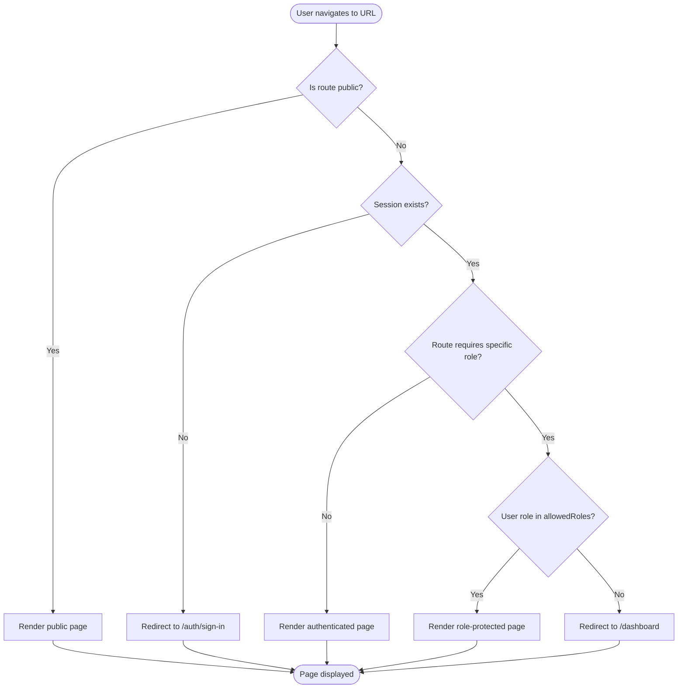
```mermaid
flowchart TD
    Start([User navigates to URL]) --> CheckPublic{Is route public?}

    CheckPublic -->|Yes| RenderPublic[Render public page]
    CheckPublic -->|No| CheckSession{Session exists?}

    CheckSession -->|No| RedirectSignIn[Redirect to /auth/sign-in]
    CheckSession -->|Yes| CheckRoleRequired{Route requires specific role?}

    CheckRoleRequired -->|No| RenderAuth[Render authenticated page]
    CheckRoleRequired -->|Yes| CheckRole{User role in allowedRoles?}

    CheckRole -->|Yes| RenderRole[Render role-protected page]
    CheckRole -->|No| RedirectDashboard[Redirect to /dashboard]

    RenderPublic --> End([Page displayed])
    RenderAuth --> End
    RenderRole --> End
    RedirectSignIn --> End
    RedirectDashboard --> End
```

### 11. Activity Diagram — File Upload Processing

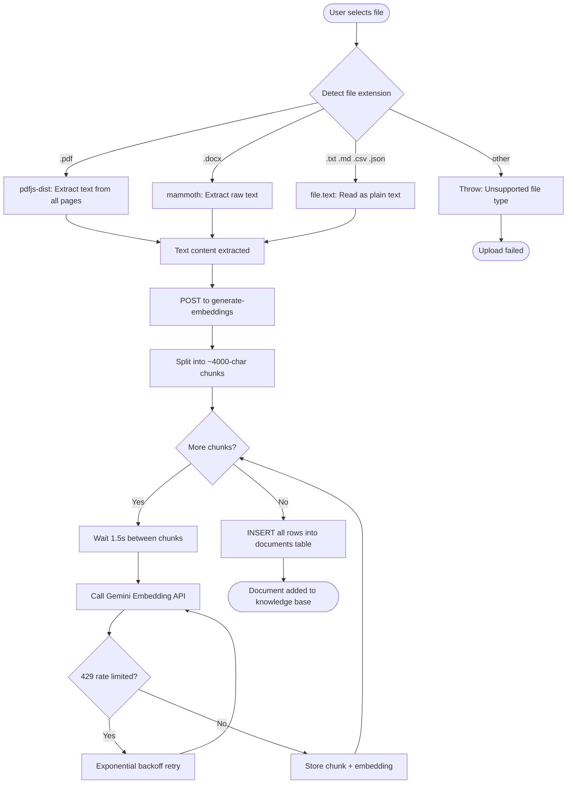
```mermaid
flowchart TD
    Start([User selects file]) --> DetectExt{Detect file extension}

    DetectExt -->|.pdf| ParsePDF[pdfjs-dist: Extract text from all pages]
    DetectExt -->|.docx| ParseDOCX[mammoth: Extract raw text]
    DetectExt -->|.txt .md .csv .json| ParseText[file.text: Read as plain text]
    DetectExt -->|other| Error[Throw: Unsupported file type]

    ParsePDF --> TextReady[Text content extracted]
    ParseDOCX --> TextReady
    ParseText --> TextReady

    TextReady --> SendToEdge[POST to generate-embeddings]
    SendToEdge --> Chunk[Split into ~4000-char chunks]
    Chunk --> Loop{More chunks?}

    Loop -->|Yes| Wait[Wait 1.5s between chunks]
    Wait --> Embed[Call Gemini Embedding API]
    Embed --> RateLimit{429 rate limited?}
    RateLimit -->|Yes| Retry[Exponential backoff retry]
    Retry --> Embed
    RateLimit -->|No| StoreChunk[Store chunk + embedding]
    StoreChunk --> Loop

    Loop -->|No| Insert[INSERT all rows into documents table]
    Insert --> Success([Document added to knowledge base])
    Error --> Fail([Upload failed])
```

### 12. Activity Diagram — Chat Conversation Flow

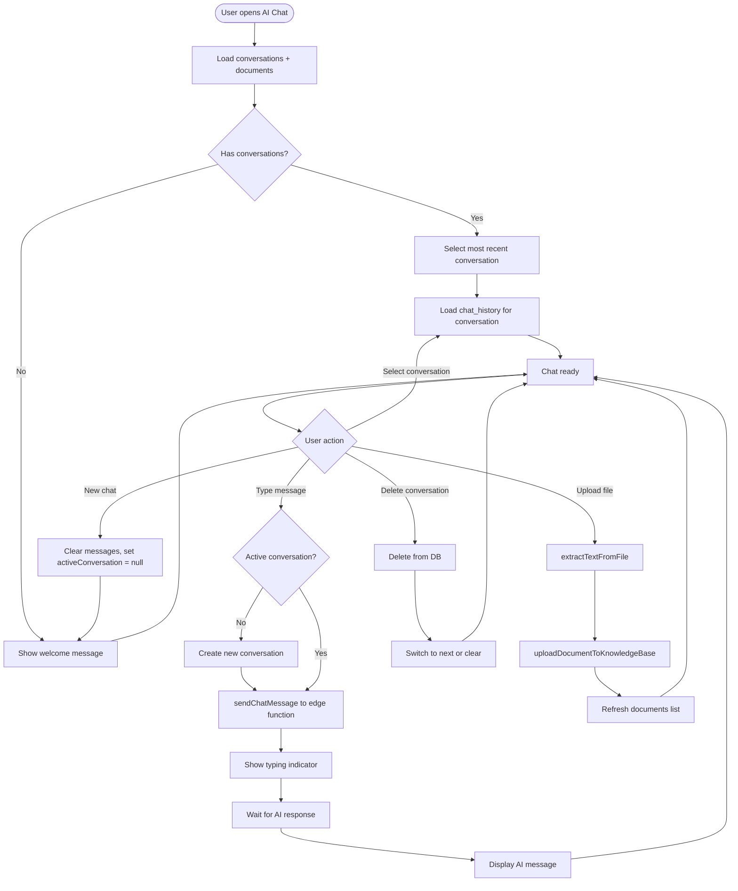
```mermaid
flowchart TD
    Start([User opens AI Chat]) --> LoadData[Load conversations + documents]
    LoadData --> HasConv{Has conversations?}

    HasConv -->|Yes| SelectFirst[Select most recent conversation]
    SelectFirst --> LoadHistory[Load chat_history for conversation]
    HasConv -->|No| ShowWelcome[Show welcome message]

    LoadHistory --> Ready[Chat ready]
    ShowWelcome --> Ready

    Ready --> UserAction{User action}

    UserAction -->|Type message| CheckConv{Active conversation?}
    CheckConv -->|No| CreateConv[Create new conversation]
    CreateConv --> SendMsg[sendChatMessage to edge function]
    CheckConv -->|Yes| SendMsg

    SendMsg --> ShowTyping[Show typing indicator]
    ShowTyping --> WaitResponse[Wait for AI response]
    WaitResponse --> DisplayResponse[Display AI message]
    DisplayResponse --> Ready

    UserAction -->|Upload file| ExtractText[extractTextFromFile]
    ExtractText --> UploadKB[uploadDocumentToKnowledgeBase]
    UploadKB --> RefreshDocs[Refresh documents list]
    RefreshDocs --> Ready

    UserAction -->|New chat| ClearChat[Clear messages, set activeConversation = null]
    ClearChat --> ShowWelcome

    UserAction -->|Select conversation| LoadHistory

    UserAction -->|Delete conversation| DeleteConv[Delete from DB]
    DeleteConv --> SwitchConv[Switch to next or clear]
    SwitchConv --> Ready
```

### 13. State Diagram — Authentication State

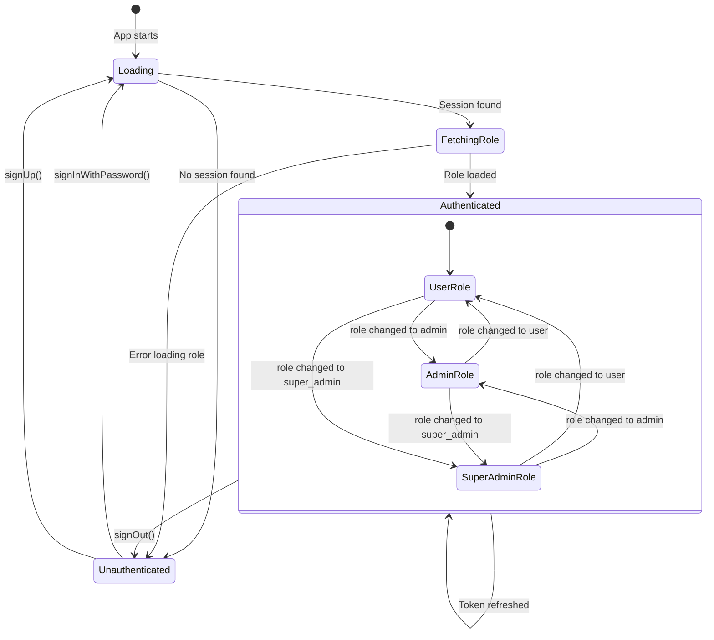
```mermaid
stateDiagram-v2
    [*] --> Loading : App starts

    Loading --> Unauthenticated : No session found
    Loading --> FetchingRole : Session found

    FetchingRole --> Authenticated : Role loaded
    FetchingRole --> Unauthenticated : Error loading role

    Unauthenticated --> Loading : signInWithPassword()
    Unauthenticated --> Loading : signUp()

    Authenticated --> Unauthenticated : signOut()
    Authenticated --> Authenticated : Token refreshed

    state Authenticated {
        [*] --> UserRole
        UserRole --> AdminRole : role changed to admin
        UserRole --> SuperAdminRole : role changed to super_admin
        AdminRole --> UserRole : role changed to user
        AdminRole --> SuperAdminRole : role changed to super_admin
        SuperAdminRole --> UserRole : role changed to user
        SuperAdminRole --> AdminRole : role changed to admin
    }
```

### 14. State Diagram — Chat Widget State

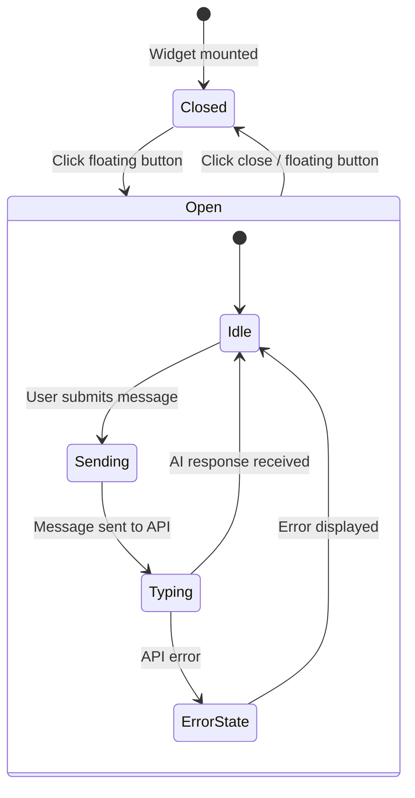
```mermaid
stateDiagram-v2
    [*] --> Closed : Widget mounted

    Closed --> Open : Click floating button
    Open --> Closed : Click close / floating button

    state Open {
        [*] --> Idle

        Idle --> Sending : User submits message
        Sending --> Typing : Message sent to API
        Typing --> Idle : AI response received
        Typing --> ErrorState : API error
        ErrorState --> Idle : Error displayed
    }
```

### 15. State Diagram — Conversation Lifecycle

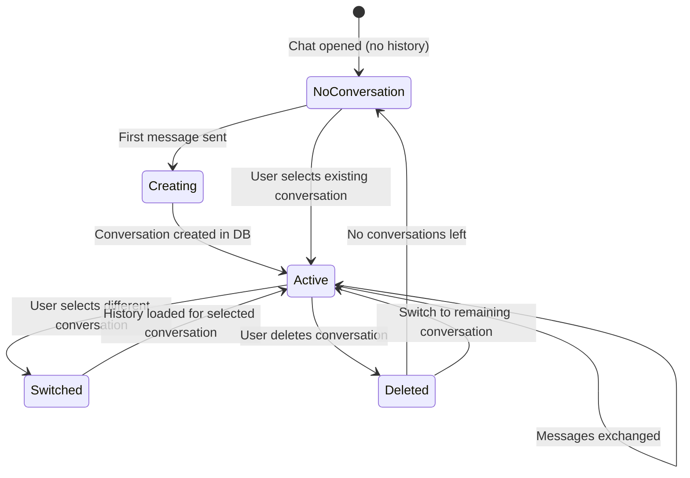
```mermaid
stateDiagram-v2
    [*] --> NoConversation : Chat opened (no history)

    NoConversation --> Creating : First message sent
    Creating --> Active : Conversation created in DB
    Active --> Active : Messages exchanged
    Active --> Switched : User selects different conversation
    Switched --> Active : History loaded for selected conversation
    Active --> Deleted : User deletes conversation
    Deleted --> NoConversation : No conversations left
    Deleted --> Active : Switch to remaining conversation

    NoConversation --> Active : User selects existing conversation
```

### 16. Component Diagram — React Architecture

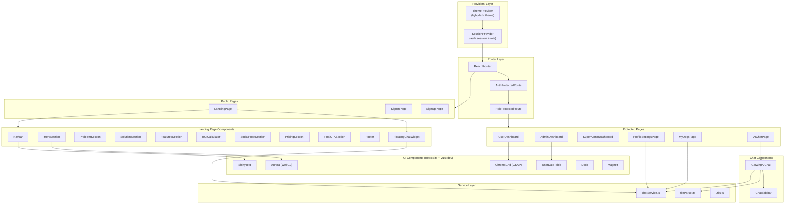
```mermaid
flowchart TB
    subgraph Providers["Providers Layer"]
        TP["ThemeProvider\n(light/dark theme)"]
        SP["SessionProvider\n(auth session + role)"]
    end

    subgraph Router["Router Layer"]
        RR["React Router"]
        APR["AuthProtectedRoute"]
        RPR["RoleProtectedRoute"]
    end

    subgraph PublicPages["Public Pages"]
        LP["LandingPage"]
        SIP["SignInPage"]
        SUP["SignUpPage"]
    end

    subgraph LandingComponents["Landing Page Components"]
        NB["Navbar"]
        HS["HeroSection"]
        PS["ProblemSection"]
        SS["SolutionSection"]
        FS["FeaturesSection"]
        ROI["ROICalculator"]
        SPS["SocialProofSection"]
        PRS["PricingSection"]
        CTA["FinalCTASection"]
        FT["Footer"]
        FCW["FloatingChatWidget"]
    end

    subgraph ProtectedPages["Protected Pages"]
        UD["UserDashboard"]
        AD["AdminDashboard"]
        SAD["SuperAdminDashboard"]
        PSP["ProfileSettingsPage"]
        MDP["MyDogsPage"]
        AIC["AIChatPage"]
    end

    subgraph ChatComponents["Chat Components"]
        GAC["GlowingAIChat"]
        CSB["ChatSidebar"]
    end

    subgraph UIComponents["UI Components (ReactBits + 21st.dev)"]
        AU["Aurora (WebGL)"]
        ST["ShinyText"]
        CG["ChromaGrid (GSAP)"]
        UDT["UserDataTable"]
        DK["Dock"]
        MG["Magnet"]
    end

    subgraph Services["Service Layer"]
        CS["chatService.ts"]
        FP["fileParser.ts"]
        UT["utils.ts"]
    end

    TP --> SP --> RR
    RR --> PublicPages
    RR --> APR --> RPR --> ProtectedPages

    LP --> LandingComponents
    HS --> AU
    NB --> ST
    LP --> FCW
    FCW --> CS

    AIC --> GAC
    GAC --> CSB
    GAC --> FP
    GAC --> CS

    UD --> CG
    AD --> UDT

    PSP --> CS
    MDP --> CS
```

### 17. Deployment Diagram

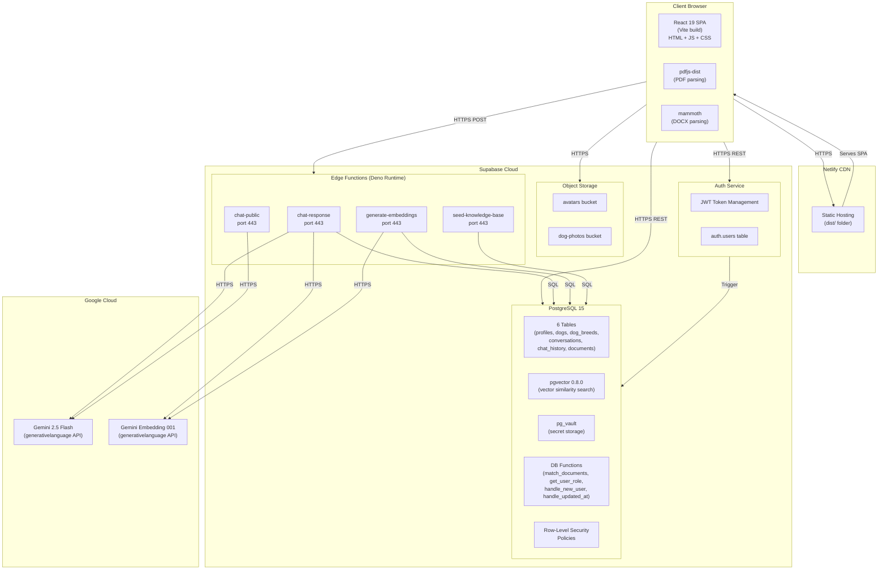
```mermaid
flowchart TB
    subgraph Browser["Client Browser"]
        React["React 19 SPA\n(Vite build)\nHTML + JS + CSS"]
        PDFJS["pdfjs-dist\n(PDF parsing)"]
        Mammoth["mammoth\n(DOCX parsing)"]
    end

    subgraph Netlify["Netlify CDN"]
        Static["Static Hosting\n(dist/ folder)"]
    end

    subgraph Supabase["Supabase Cloud"]
        subgraph Auth["Auth Service"]
            JWT["JWT Token Management"]
            AuthDB["auth.users table"]
        end

        subgraph Database["PostgreSQL 15"]
            Tables["6 Tables\n(profiles, dogs, dog_breeds,\nconversations, chat_history, documents)"]
            PGV["pgvector 0.8.0\n(vector similarity search)"]
            Vault["pg_vault\n(secret storage)"]
            Functions["DB Functions\n(match_documents, get_user_role,\nhandle_new_user, handle_updated_at)"]
            RLS["Row-Level Security\nPolicies"]
        end

        subgraph Storage["Object Storage"]
            Avatars["avatars bucket"]
            DogPhotos["dog-photos bucket"]
        end

        subgraph Edge["Edge Functions (Deno Runtime)"]
            EF1["chat-response\nport 443"]
            EF2["chat-public\nport 443"]
            EF3["generate-embeddings\nport 443"]
            EF4["seed-knowledge-base\nport 443"]
        end
    end

    subgraph Google["Google Cloud"]
        GemFlash["Gemini 2.5 Flash\n(generativelanguage API)"]
        GemEmbed["Gemini Embedding 001\n(generativelanguage API)"]
    end

    Browser -->|"HTTPS"| Static
    Static -->|"Serves SPA"| Browser
    Browser -->|"HTTPS REST"| Auth
    Browser -->|"HTTPS REST"| Database
    Browser -->|"HTTPS"| Storage
    Browser -->|"HTTPS POST"| Edge

    EF1 -->|"HTTPS"| GemFlash
    EF1 -->|"HTTPS"| GemEmbed
    EF1 -->|"SQL"| Database
    EF2 -->|"HTTPS"| GemFlash
    EF3 -->|"HTTPS"| GemEmbed
    EF3 -->|"SQL"| Database
    EF4 -->|"SQL"| Database

    Auth -->|"Trigger"| Database
```

### 18. Entity Relationship Diagram

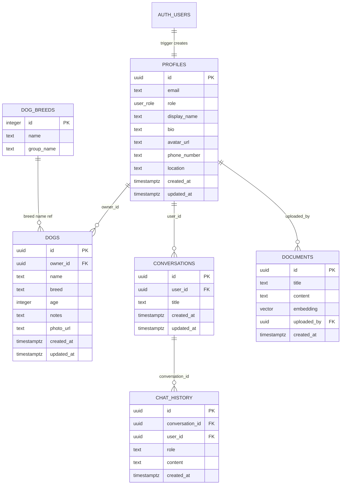
```mermaid
erDiagram
    AUTH_USERS ||--|| PROFILES : "trigger creates"
    PROFILES ||--o{ DOGS : "owner_id"
    PROFILES ||--o{ CONVERSATIONS : "user_id"
    PROFILES ||--o{ DOCUMENTS : "uploaded_by"
    CONVERSATIONS ||--o{ CHAT_HISTORY : "conversation_id"
    DOG_BREEDS ||--o{ DOGS : "breed name ref"

    PROFILES {
        uuid id PK
        text email
        user_role role
        text display_name
        text bio
        text avatar_url
        text phone_number
        text location
        timestamptz created_at
        timestamptz updated_at
    }

    DOGS {
        uuid id PK
        uuid owner_id FK
        text name
        text breed
        integer age
        text notes
        text photo_url
        timestamptz created_at
        timestamptz updated_at
    }

    DOG_BREEDS {
        integer id PK
        text name
        text group_name
    }

    CONVERSATIONS {
        uuid id PK
        uuid user_id FK
        text title
        timestamptz created_at
        timestamptz updated_at
    }

    CHAT_HISTORY {
        uuid id PK
        uuid conversation_id FK
        uuid user_id FK
        text role
        text content
        timestamptz created_at
    }

    DOCUMENTS {
        uuid id PK
        text title
        text content
        vector embedding
        uuid uploaded_by FK
        timestamptz created_at
    }
```

### 19. RBAC & Route Guard Flowchart

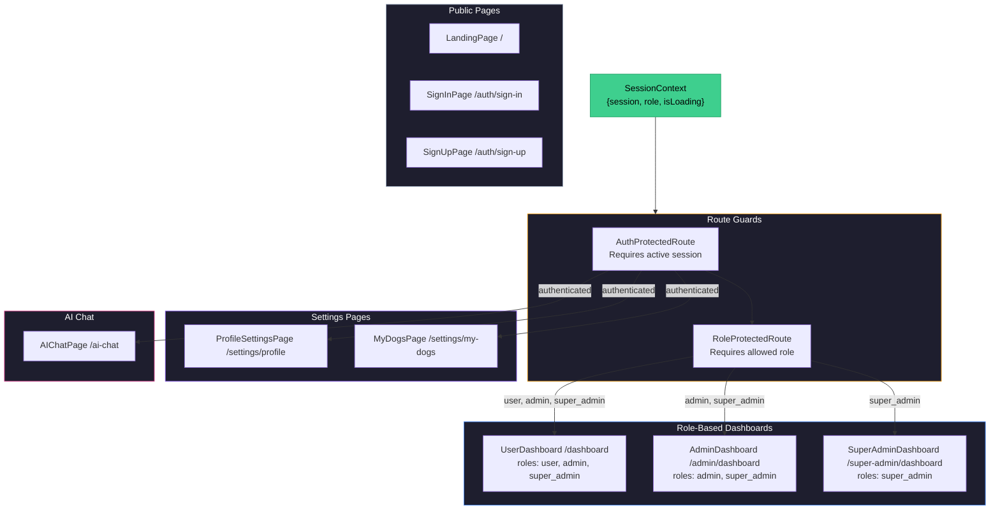
```mermaid
flowchart TD
    Session["SessionContext\n{session, role, isLoading}"]

    subgraph Guards["Route Guards"]
        Auth["AuthProtectedRoute\nRequires active session"]
        Role["RoleProtectedRoute\nRequires allowed role"]
    end

    subgraph Public["Public Pages"]
        LP["LandingPage /"]
        SI["SignInPage /auth/sign-in"]
        SU["SignUpPage /auth/sign-up"]
    end

    subgraph Dashboards["Role-Based Dashboards"]
        UD["UserDashboard /dashboard\nroles: user, admin, super_admin"]
        AD["AdminDashboard /admin/dashboard\nroles: admin, super_admin"]
        SAD["SuperAdminDashboard /super-admin/dashboard\nroles: super_admin"]
    end

    subgraph Settings["Settings Pages"]
        PS2["ProfileSettingsPage /settings/profile"]
        MD["MyDogsPage /settings/my-dogs"]
    end

    subgraph Chat["AI Chat"]
        AC["AIChatPage /ai-chat"]
    end

    Session --> Guards
    Auth --> Role
    Role -->|"user, admin, super_admin"| UD
    Role -->|"admin, super_admin"| AD
    Role -->|"super_admin"| SAD
    Auth -->|"authenticated"| PS2
    Auth -->|"authenticated"| MD
    Auth -->|"authenticated"| AC

    style Session fill:#3ecf8e,stroke:#229f65,color:#000
    style Guards fill:#1e1e2e,stroke:#f59e0b,color:#fff
    style Public fill:#1e1e2e,stroke:#94a3b8,color:#fff
    style Dashboards fill:#1e1e2e,stroke:#3b82f6,color:#fff
    style Settings fill:#1e1e2e,stroke:#8b5cf6,color:#fff
    style Chat fill:#1e1e2e,stroke:#ec4899,color:#fff
```

### 20. Full System Architecture

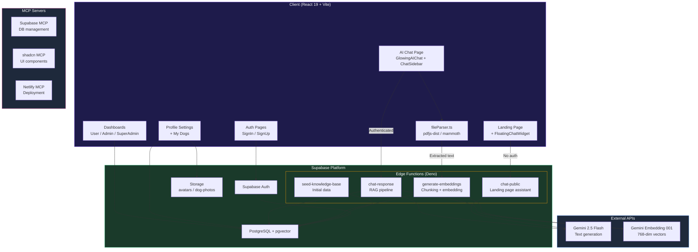
```mermaid
flowchart TB
    subgraph Client["Client (React 19 + Vite)"]
        LP2["Landing Page\n+ FloatingChatWidget"]
        AuthP["Auth Pages\nSignIn / SignUp"]
        Dash["Dashboards\nUser / Admin / SuperAdmin"]
        AICP["AI Chat Page\nGlowingAIChat + ChatSidebar"]
        Prof["Profile Settings\n+ My Dogs"]
        FParse["fileParser.ts\npdfjs-dist / mammoth"]
    end

    subgraph Supabase["Supabase Platform"]
        SAuth["Supabase Auth"]
        SDB["PostgreSQL + pgvector"]
        SStorage["Storage\navatars / dog-photos"]

        subgraph EdgeFunctions["Edge Functions (Deno)"]
            EF1["chat-response\nRAG pipeline"]
            EF2["chat-public\nLanding page assistant"]
            EF3["generate-embeddings\nChunking + embedding"]
            EF4["seed-knowledge-base\nInitial data"]
        end
    end

    subgraph External["External APIs"]
        GeminiLLM["Gemini 2.5 Flash\nText generation"]
        GeminiEmb["Gemini Embedding 001\n768-dim vectors"]
    end

    subgraph MCP["MCP Servers"]
        MCP1["Supabase MCP\nDB management"]
        MCP2["shadcn MCP\nUI components"]
        MCP3["Netlify MCP\nDeployment"]
    end

    LP2 -->|"No auth"| EF2
    AuthP --> SAuth
    AICP -->|"Authenticated"| EF1
    AICP --> FParse
    FParse -->|"Extracted text"| EF3
    Dash --> SDB
    Prof --> SDB
    Prof --> SStorage

    EF1 --> GeminiEmb
    EF1 --> GeminiLLM
    EF1 --> SDB
    EF2 --> GeminiLLM
    EF3 --> GeminiEmb
    EF3 --> SDB
    EF4 --> SDB

    SAuth --> SDB

    style Client fill:#1e1b4b,stroke:#8b5cf6,color:#fff
    style Supabase fill:#1a3a2a,stroke:#3ecf8e,color:#fff
    style EdgeFunctions fill:#1a3a2a,stroke:#f59e0b,color:#fff
    style External fill:#1e293b,stroke:#60a5fa,color:#fff
    style MCP fill:#1e293b,stroke:#f472b6,color:#fff
```

---

## Project Structure

```
src/
├── components/
│   ├── backgrounds/
│   │   └── Aurora.jsx              # ReactBits — WebGL aurora background (OGL)
│   ├── common/
│   │   ├── Button.tsx
│   │   ├── Container.tsx
│   │   └── SectionWrapper.tsx
│   ├── landing/
│   │   ├── Navbar.tsx
│   │   ├── HeroSection.tsx
│   │   ├── ProblemSection.tsx
│   │   ├── SolutionSection.tsx
│   │   ├── FeaturesSection.tsx
│   │   ├── ROICalculator.tsx
│   │   ├── SocialProofSection.tsx
│   │   ├── PricingSection.tsx
│   │   ├── FinalCTASection.tsx
│   │   └── Footer.tsx
│   ├── layout/
│   │   └── DashboardLayout.tsx
│   ├── ui/
│   │   ├── ChromaGrid.tsx          # ReactBits — GSAP interactive grid
│   │   ├── Dock.tsx                # ReactBits — macOS-style dock
│   │   ├── Magnet.tsx              # ReactBits — Magnetic hover effect
│   │   ├── ShinyText.tsx           # ReactBits — Animated gradient text
│   │   └── UserDataTable.tsx       # 21st.dev — Popover + Data Table
│   ├── ChatSidebar.tsx
│   ├── FloatingChatWidget.tsx      # Public chat (no auth)
│   └── GlowingAIChat.tsx           # Authenticated RAG chat
├── context/
│   ├── SessionContext.tsx           # Auth session + role provider
│   └── ThemeContext.tsx             # Light/dark theme provider
├── hooks/
│   └── useReducedMotion.ts         # Accessibility: prefers-reduced-motion
├── lib/
│   ├── chatService.ts              # Chat, documents, conversations CRUD
│   ├── fileParser.ts               # PDF/DOCX/TXT text extraction
│   └── utils.ts                    # cn() utility (clsx + tailwind-merge)
├── pages/
│   ├── auth/
│   │   ├── SignInPage.tsx           # Role-based redirect after login
│   │   └── SignUpPage.tsx
│   ├── dashboard/
│   │   ├── UserDashboard.tsx        # ChromaGrid for dogs
│   │   ├── AdminDashboard.tsx       # UserDataTable for all users
│   │   └── SuperAdminDashboard.tsx  # Full CRUD on users
│   ├── settings/
│   │   ├── ProfileSettingsPage.tsx  # Edit profile + avatar upload
│   │   └── MyDogsPage.tsx           # CRUD dogs + photo upload
│   ├── 404Page.tsx
│   ├── AIChatPage.tsx
│   ├── HomePage.tsx
│   ├── LandingPage.tsx
│   ├── LoadingPage.tsx
│   └── ProtectedPage.tsx
├── router/
│   ├── index.tsx                    # All route definitions
│   ├── AuthProtectedRoute.tsx       # Requires active session
│   └── RoleProtectedRoute.tsx       # Requires allowed role
├── supabase/
│   └── index.ts                     # Supabase client instance
├── types/
│   └── landing.ts
├── utils/
│   └── roiCalculator.ts
├── config.ts                        # VITE_SUPABASE_URL + ANON_KEY
├── main.tsx
├── Providers.tsx                    # SessionProvider + ThemeProvider
└── index.css
```

---

## Getting Started

1. **Clone** the repository
2. **Install** dependencies:
   ```bash
   npm install
   ```
3. **Configure** environment variables — create `.env.local`:
   ```
   VITE_SUPABASE_URL=your_supabase_url
   VITE_SUPABASE_ANON_KEY=your_supabase_anon_key
   ```
4. **Run** the development server:
   ```bash
   npm run dev
   ```
5. Open **http://localhost:5174**

---

## Category Mapping

### 1. Authentication & Roles

| | Detail |
|---|---|
| **Route** | `/auth/sign-in`, `/auth/sign-up`, `/dashboard`, `/admin/dashboard`, `/super-admin/dashboard` |
| **Components** | `SignInPage`, `SignUpPage`, `SessionContext`, `AuthProtectedRoute`, `RoleProtectedRoute` |
| **Tables** | `profiles` (role column: `user`, `admin`, `super_admin`) |
| **How to Test** | Sign up (default role = user, redirects to `/dashboard`). Change role in Supabase to `admin` or `super_admin` and re-login to see role-based redirect. Try accessing `/admin/dashboard` as `user` — blocked. Sign out — protected routes redirect to sign-in. |

### 2. Editable User Profile

| | Detail |
|---|---|
| **Route** | `/settings/profile`, `/settings/my-dogs` |
| **Components** | `ProfileSettingsPage`, `MyDogsPage` |
| **Tables** | `profiles`, `dogs`, `dog_breeds` |
| **Storage** | `avatars` bucket, `dog-photos` bucket |
| **How to Test** | Edit display name, bio, phone, location — save — refresh — values persist. Upload/remove avatar. Add a dog with breed from dropdown + photo. Edit and delete dogs. |

### 3. Supabase Database

| | Detail |
|---|---|
| **Tables** | `profiles`, `dogs`, `dog_breeds`, `conversations`, `chat_history`, `documents` |
| **Functions** | `handle_new_user`, `handle_updated_at`, `get_user_role`, `match_documents`, `vault_read_secret` |
| **Extensions** | pgvector 0.8.0, pg_vault |
| **How to Test** | RLS: as `user`, query profiles — only own row. As `admin`, all rows readable. Updating own role blocked. `match_documents` returns similar documents by cosine similarity. |

### 4. Advanced UI Components

| | Detail |
|---|---|
| **Location** | `/` (Aurora, ShinyText), `/dashboard` (ChromaGrid), `/admin/dashboard` (UserDataTable with Popover) |
| **Libraries** | ReactBits (Aurora, ShinyText, ChromaGrid), 21st.dev (Popover, Project Data Table), Framer Motion, GSAP, OGL |
| **How to Test** | Landing page: Aurora background animates, ShinyText shines on logo. Dashboard: ChromaGrid cards follow mouse. Admin: data table rows animate in, search/filter/column toggles work. |

### 5. Supabase Edge Functions

| | Detail |
|---|---|
| **Functions** | `chat-response` (v6), `chat-public` (v1), `generate-embeddings` (v7), `seed-knowledge-base` (v2) |
| **How to Test** | Landing page widget: ask about pricing (chat-public, no login). Login + AI Chat: send message (chat-response with RAG). Upload PDF/DOCX (generate-embeddings with chunking). Ask about uploaded content — relevant chunks returned. |

### 6. MCP Server Integration

| | Detail |
|---|---|
| **Config** | `.mcp.json` |
| **Servers** | Supabase MCP (DB management), shadcn MCP (UI components), Netlify MCP (deployment) |
| **How to Test** | In Claude Code: `list_tables` via Supabase MCP returns project tables. `search_items_in_registries` via shadcn MCP returns components. Netlify MCP manages deployments. |

### 7. RAG Chatbot with pgvector

| | Detail |
|---|---|
| **Route** | `/ai-chat` (authenticated), `/` floating widget (public) |
| **Components** | `GlowingAIChat`, `ChatSidebar`, `FloatingChatWidget`, `chatService`, `fileParser` |
| **Tables** | `conversations`, `chat_history`, `documents` |
| **How to Test** | Login + AI Chat: send message — AI responds with RAG context. Upload .txt/.pdf/.docx — added to knowledge base. Ask about uploaded content — relevant answer. Multiple conversations with history. Landing page widget answers without login, suggests sign-up for personalized help. |

### 8. One-Page Write-Up

| | Detail |
|---|---|
| **Location** | `README.md` (this file) |
| **Content** | Project overview, tech stack, all 6 database tables, 4 edge functions, 3 MCP servers, 7 architecture diagrams (Mermaid), route table, component library credits, category mapping with test instructions |

---

## License

MIT
